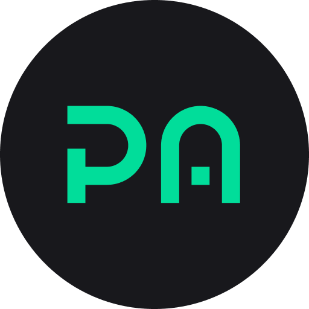

# PettersonApps

The main corporate website, showcasing services and solutions provided by the company. The website is built to support multilingual content and is fully responsive.

## Tech Stack

- **Frontend**: Next.js, TypeScript
- **Styling**: TailwindCSS
- **Routing**: Next.js
- **Form Management**: React Hook Form
- **Validation**: Zod
- **Internationalization**: next-intl

## Deployment Details

- **CI/CD**: Automatic deployments via Firebase Hosting:
- **Production site**: [https://petterson-website.web.app/](https://petterson-website.web.app/)
  - Firebase `site`: `petterson-website`
  - Public directory: `dist`
- **Development site**: [https://petterson-website-develop.web.app/](https://petterson-website-develop.web.app/)
  - Firebase `site`: `petterson-website-develop`
  - Public directory: `dist`

### Firebase Configuration

The `firebase.json` file is configured as follows:

- **Rewrites**: All requests are redirected to `index.html` for SPA routing.
- **Ignored files**:
  - `firebase.json`
  - Hidden files (`.*`)
  - `node_modules`

For details, refer to the `firebase.json` file in the project.

## Local Setup

1. Clone the repository:

```bash
git clone git@github.com:your-organization/petterson-website.git
cd petterson-website.git
```

2. Install dependencies:

```bash
yarn install
```

3. Environment variables:

```bash
cp .env.example .env
NEXT_PUBLIC_API_BASE_URL=https://api.example.com
```

4. Start the development server:

```bash
yarn dev
```

5. Build the project for production:

```bash
yarn build
```
